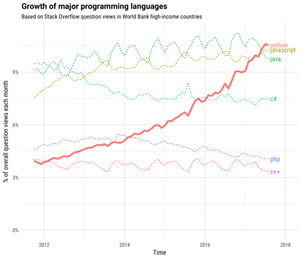

# Programación de aplicaciones geoespaciales en Python
------------------------------------------------------
|  |  |
|:---:|:---:|
| Atlas _Theatrum Orbis Terrarum_ de Abraham Ortelius (1570) Fuente: [Wikipedia](https://en.wikipedia.org/wiki/Theatrum_Orbis_Terrarum)| Logotipo del lenguaje Python Fuente: [Python.org](http://www.python.org/)|

Este es un curso introductorio a la programación de aplicaciones geoespaciales en el lenguaje de programación Python.

Sitio web:
[https://mfvargas.github.io/curso-python-geoespacial/](https://mfvargas.github.io/curso-python-geoespacial/)

## Índice
---------
[1. Acerca de Python](https://github.com/mfvargas/curso-python-geoespacial/blob/master/README.md#1-acerca-de-python)

## 1. Acerca de Python
----------------------
[Python](https://www.python.org/) es un lenguaje de programación de propósito general que ha alcanzado una [gran popularidad en los últimos años](https://www.infoworld.com/article/3331603/pythons-popularity-surges-as-a-mainstay-language.html). Fue declarado el lenguaje del año 2018 por el índice [Tiobe](https://www.tiobe.com/tiobe-index/) de popularidad de lenguajes de programación, debido al crecimiento de su uso en diversas áreas, entre las que destacan la [ciencia de datos](https://en.wikipedia.org/wiki/Data_science) y el [aprendizaje de máquinas](https://en.wikipedia.org/wiki/Machine_learning), además de otras como [pruebas de sistemas](https://en.wikipedia.org/wiki/System_testing), [desarrollo web](https://en.wikipedia.org/wiki/Web_development), [scripting](https://en.wikipedia.org/wiki/Scripting_language) y [visualización de datos](https://en.wikipedia.org/wiki/Data_visualization), entre muchas. Esta popularidad es respaldada por otras fuentes como el índice [PYPL](http://pypl.github.io/PYPL.html) y la comunidad de programadores [Stack Overflow](https://stackoverflow.com/). Esta última lo considera el [lenguaje de programación de mayor crecimiento en los países de alto ingreso](https://stackoverflow.blog/2017/09/06/incredible-growth-python/?_ga=2.202250515.367846061.1552160385-2089845565.1546395318), como se muestra en la figura 2.

|  |
|:---:|
| Figura 2. Crecimiento de los principales lenguajes de programación en los países de alto ingreso Fuente: [Stack Overflow](https://stackoverflow.blog/2017/09/06/incredible-growth-python/?_ga=2.202250515.367846061.1552160385-2089845565.1546395318)|

En la actualidad, Python es ampliamente utilizado en enseñanza de la programación y es el [lenguaje más empleado en cursos introductorios de programación de las principales universidades de Estados Unidos](https://cacm.acm.org/blogs/blog-cacm/176450-python-is-now-the-most-popular-introductory-teaching-language-at-top-u-s-universities/fulltext) debido, entre otras razones, a que sus programas son fáciles de leer y requieren menos líneas de código que otros lenguajes de amplia difusión, tales como [Java](http://oracle.com/java/), [C](https://en.wikipedia.org/wiki/C_(programming_language)) o [C++](https://isocpp.org/).

Python fue creado por el programador holandés [Guido van Rossum](https://gvanrossum.github.io//), quién concibió el diseño original del lenguaje a finales de la década de 1980 y dio a conocer la primera versión en 1991. El nombre del lenguaje es un homenaje al grupo de comedia británico [Monty Python](https://es.wikipedia.org/wiki/Monty_Python). Según van Rossum, en diciembre de 1989 buscaba un proyecto de programación como "pasatiempo" durante los días cercanos a la navidad, por lo que decidió escribir un interpretador para un lenguaje de programación en el que había estado pensando recientemente. Escogió el nombre Python por encontrarse en un "humor ligeramente irreverente" y ser un gran aficionado al programa de televisión ["El circo volador de Monty Python" (_Monty Python's Flying Circus_)](https://en.wikipedia.org/wiki/Monty_Python%27s_Flying_Circus).

|  |  |
|:---:|:---:|
| Figura 3. Guido van Rossum, creador de Python Fuente: [Wikimedia Commons](https://commons.wikimedia.org/wiki/File:Guido-portrait-2014.jpg) | Figura 4. El circo volador de Monty Python Fuente: [Internet Movie Database (IMDB)](http://www.imdb.com/title/tt0063929/)|

### Principales características del lenguaje
* Es [interpretado](https://en.wikipedia.org/wiki/Interpreter_(computing)): las instrucciones se traducen una por una a [lenguaje máquina](https://en.wikipedia.org/wiki/Machine_code), a diferencia de los [lenguajes compilados](https://en.wikipedia.org/wiki/Compiler), que traducen simultáneamente una unidad completa (ej. un programa o una biblioteca). Los lenguajes interpretados tienden a ser más lentos que los compilados, pero también son más flexibles como entornos de desarrollo y depuración.
* Es [multiplataforma](https://en.wikipedia.org/wiki/Cross-platform_software): puede ejecutarse en los sistemas operativos más populares (ej. Microsoft Windows, macOS, Linux).
* Ofrece un [sistema de tipos de datos](https://en.wikipedia.org/wiki/Type_system) dinámico: las variables pueden tomar diferentes tipos de datos (ej. textuales, numéricos) durante la ejecución del programa, a diferencia de un sistema de tipos de datos estático, en el que las variables solo pueden tener un tipo de datos. La mayoría de los lenguajes de tipos dinámicos son lenguajes interpretados.
* Cuenta con [administración de memoria](https://en.wikipedia.org/wiki/Memory_management) automática. 
* Soporta varios [paradigmas de programación](https://en.wikipedia.org/wiki/Programming_paradigm): los paradigmas son estilos o enfoques teóricos de programación. En el caso de Python, incluye [programación orientada a objetos](https://en.wikipedia.org/wiki/Object-oriented_programming), [programación imperativa](https://en.wikipedia.org/wiki/Imperative_programming), [programación funcional](https://en.wikipedia.org/wiki/Functional_programming) y [programación procedimental](https://en.wikipedia.org/wiki/Procedural_programming).

La implementación de referencia del interpretador de Python, llamada [CPython](https://en.wikipedia.org/wiki/CPython), es software de [código abierto (_open source_)](https://en.wikipedia.org/wiki/Open-source_model), lo que facilita que el desarrollo de Python sea conducido por una comunidad de programadores que se comunican a través de Internet. Este modelo es seguido por la mayoría de las implementaciones del interpretador de Python. Una muestra muy representativa de este esquema de colaboración es el [Python Package Index (PyPI)](https://pypi.python.org), un repositorio para compartir componentes de software programados con Python, que a la fecha alberga más de 170000 proyectos.

[Python Software Foundation (PSF)](https://www.python.org/psf/) es la organización sin fines de lucro que posee los derechos de propiedad intelectual del lenguaje Python y que maneja las licencias de software libre con las que se distribuye. Su misión es _"promover, proteger y avanzar el lenguaje de programación Python, así como apoyar y facilitar el crecimiento de una comunidad diversa e internacional de programadores de Python"_.

### Aplicación en datos geoespaciales
Python ha tomado una gran importancia en el área del desarrollo de aplicaciones geoespaciales debido a su popularidad, "suavidad" de la curva de aprendizaje y abundancia de recursos de educación y consulta (ej. tutoriales, libros, listas de correo, foros de discusión). Todas estas son características que, entre otras, lo hacen muy apropiado para programadores que no son especialistas en ciencias de la computación, como es el caso de muchos de los usuarios de sistemas de información geográfica (SIG). De hecho, muchas de estas [herramientas han seleccionado a Python](http://www.mdpi.com/2220-9964/2/1/201) como el lenguaje de preferencia para que sus usuarios amplíen o configuren la funcionalidad que ofrecen. Como ejemplos, pueden mencionarse las bibliotecas [ArcPy](http://desktop.arcgis.com/en/arcmap/10.3/analyze/arcpy/what-is-arcpy-.htm) para [ArcGIS](https://www.arcgis.com/), [PyQGIS](https://docs.qgis.org/testing/en/docs/pyqgis_developer_cookbook/) para [QGIS](https://www.qgis.org/) y [PyGRASS](https://grass.osgeo.org/grass70/manuals/libpython/pygrass_index.html) para [GRASS GIS](https://grass.osgeo.org/). De manera similar, hay una gran cantidad de bibliotecas que ofrecen funciones geoespaciales que pueden ser utilizadas por cualquier otra herramienta. Entre estas, pueden mencionarse [GDAL/OGR](http://www.gdal.org/), para conversiones entre diferentes formatos vectoriales y raster; [PROJ](http://proj4.org/), para transformaciones entre sistemas de coordenadas y [GeoPandas](http://geopandas.org/), para análisis geoespacial. Muchas de estas bibliotecas son distribuidas con licencias de [software libre (_free software_)](https://en.wikipedia.org/wiki/Free_software).

### Python 2 vs Python 3
