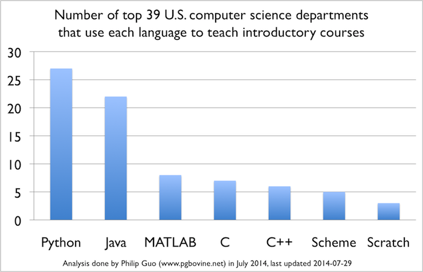
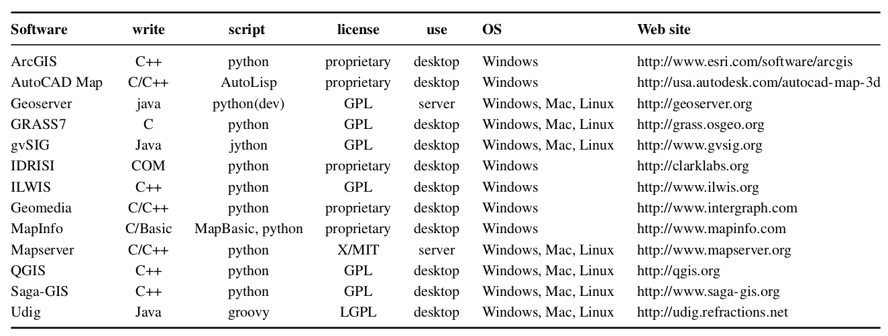
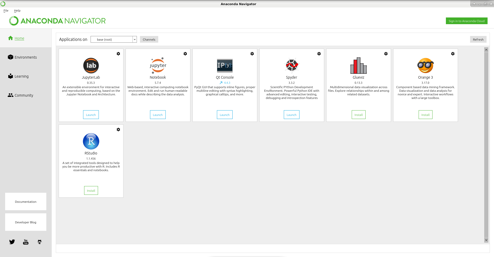
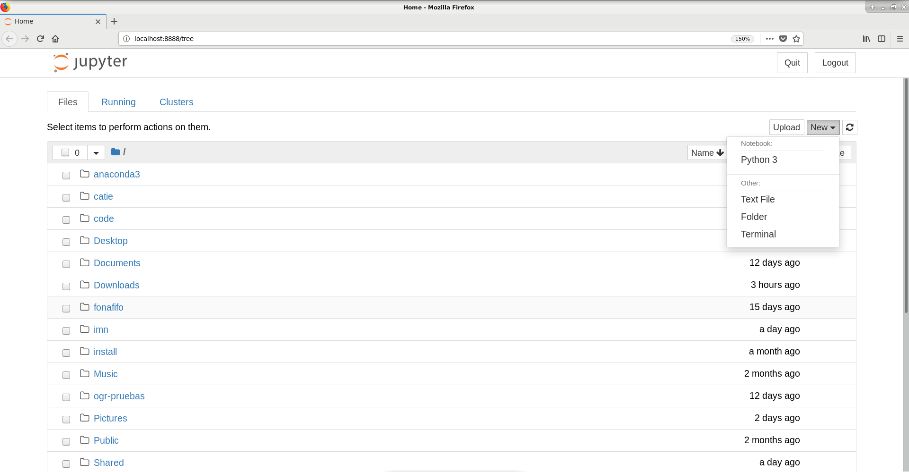
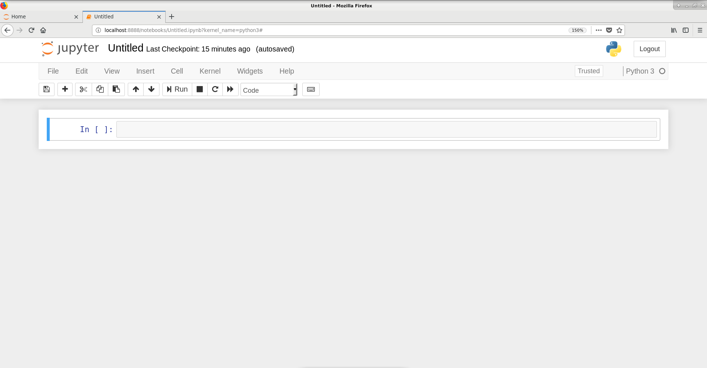
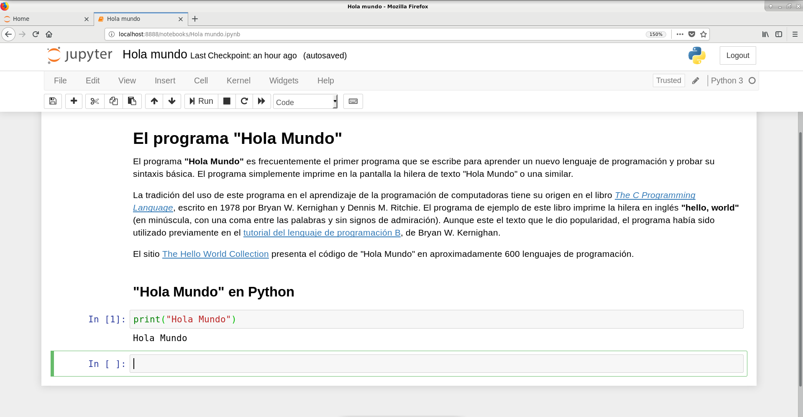

# Programación de aplicaciones geoespaciales en Python
------------------------------------------------------
|  |  |
|:---:|:---:|
| _Theatrum Orbis Terrarum_, de Abraham Ortelius (1570) Fuente: [Wikipedia](https://en.wikipedia.org/wiki/Theatrum_Orbis_Terrarum)| Logotipo del lenguaje Python Fuente: [Python.org](http://www.python.org/)|

Este es un curso introductorio a la programación de aplicaciones geoespaciales en el lenguaje de programación Python.

 <strong>Programación de aplicaciones geoespaciales en Python</strong>, escrito por <a xmlns:cc="http://creativecommons.org/ns#" href="https://github.com/mfvargas" property="cc:attributionName" rel="cc:attributionURL">Manuel Vargas</a>, se comparte mediante una <a rel="license" href="http://creativecommons.org/licenses/by/4.0/">Licencia Creative Commons Atribución 4.0 Internacional</a>.

## Índice
---------
[1. Acerca de Python](https://github.com/mfvargas/curso-python-geoespacial/blob/master/README.md#1-acerca-de-python)
- [1.1. Principales características del lenguaje](https://github.com/mfvargas/curso-python-geoespacial/blob/master/README.md#11-principales-caracter%C3%ADsticas-del-lenguaje)
- [1.2. Aplicación en datos geoespaciales](https://github.com/mfvargas/curso-python-geoespacial/blob/master/README.md#12-aplicaci%C3%B3n-en-datos-geoespaciales)
- [1.3. Python 2 y Python 3](https://github.com/mfvargas/curso-python-geoespacial/blob/master/README.md#13-python-2-y-python-3)

[2. Herramientas para desarrollo en Python](https://github.com/mfvargas/curso-python-geoespacial/blob/master/README.md#2-herramientas-para-desarrollo-en-python)
- [2.1. Editores de texto](https://github.com/mfvargas/curso-python-geoespacial/blob/master/README.md#21-editores-de-texto)
- [2.2. Ambientes integrados de desarrollo](https://github.com/mfvargas/curso-python-geoespacial/blob/master/README.md#22-ambientes-integrados-de-desarrollo)
- [2.3. Notebooks](https://github.com/mfvargas/curso-python-geoespacial/blob/master/README.md#23-notebooks)

[3. Instalación del interpretador de Python](https://github.com/mfvargas/curso-python-geoespacial/blob/master/README.md#3-instalaci%C3%B3n-del-interpretador-de-python)
- [3.1. Instalación de Anaconda](https://github.com/mfvargas/curso-python-geoespacial/blob/master/README.md#31-instalaci%C3%B3n-de-anaconda)

[4. Ejecución de programas en Python](https://github.com/mfvargas/curso-python-geoespacial/blob/master/README.md#4-ejecuci%C3%B3n-de-programas-en-python)
- [4.1. En Jupyter Notebooks](https://github.com/mfvargas/curso-python-geoespacial/blob/master/README.md#41-en-jupyter-notebooks)

[5. Sintaxis básica de Python](https://github.com/mfvargas/curso-python-geoespacial/blob/master/README.md#5-sintaxis-b%C3%A1sica-de-python)
- [5.1. Tipos de datos básicos y variables](https://github.com/mfvargas/curso-python-geoespacial/blob/master/nb/Tipos%20de%20datos%20y%20variables.ipynb)
    * [5.1.1. Números](https://github.com/mfvargas/curso-python-geoespacial/blob/master/nb/N%C3%BAmeros.ipynb)
    * [5.1.2. Hileras](https://github.com/mfvargas/curso-python-geoespacial/blob/master/nb/Hileras.ipynb)    
- [5.2. Expresiones](https://github.com/mfvargas/curso-python-geoespacial/blob/master/nb/Expresiones.ipynb)    
- [5.3. Condicionales](https://github.com/mfvargas/curso-python-geoespacial/blob/master/nb/Condicionales.ipynb)    
- [5.4. Manejo de excepciones](https://github.com/mfvargas/curso-python-geoespacial/blob/master/nb/Manejo%20de%20excepciones.ipynb)   
- [5.5. Ciclos](https://github.com/mfvargas/curso-python-geoespacial/blob/master/nb/Ciclos.ipynb)   
- [5.6. Funciones](https://github.com/mfvargas/curso-python-geoespacial/blob/master/nb/Funciones.ipynb)   
- [5.7. Programación Orientada a Objetos](https://github.com/mfvargas/curso-python-geoespacial/blob/master/nb/Programaci%C3%B3n%20Orientada%20a%20Objetos.ipynb)

[6. Módulos geoespaciales](https://github.com/mfvargas/curso-python-geoespacial/blob/master/README.md#6-m%C3%B3dulos-geoespaciales)
- [6.1 GDAL/OGR]()

[7. Recursos adicionales](https://github.com/mfvargas/curso-python-geoespacial/blob/master/README.md#7-recursos-adicionales)

## 1. Acerca de Python
----------------------
[Python](https://www.python.org/) es un lenguaje de programación de propósito general que ha alcanzado una [gran popularidad en los últimos años](https://www.infoworld.com/article/3331603/pythons-popularity-surges-as-a-mainstay-language.html). Fue declarado el lenguaje del año 2018 por el índice [Tiobe](https://www.tiobe.com/tiobe-index/) de popularidad de lenguajes de programación, debido al crecimiento de su uso en diversas áreas, entre las que destacan la [ciencia de datos](https://en.wikipedia.org/wiki/Data_science) y el [aprendizaje de máquinas](https://en.wikipedia.org/wiki/Machine_learning), además de otras como desarrollo web, _scripting_ y visualización de datos, entre muchas. Esta popularidad es respaldada por otras fuentes como el índice [PYPL](http://pypl.github.io/PYPL.html) y la comunidad de programadores [Stack Overflow](https://stackoverflow.com/). Esta última lo considera el [lenguaje de programación de mayor crecimiento en los países de alto ingreso](https://stackoverflow.blog/2017/09/06/incredible-growth-python/?_ga=2.202250515.367846061.1552160385-2089845565.1546395318), como se muestra en la figura 1.

|  |
|:---:|
| Figura 1. Crecimiento de los principales lenguajes de programación en los países de alto ingreso. Fuente: [Stack Overflow](https://stackoverflow.blog/2017/09/06/incredible-growth-python/?_ga=2.202250515.367846061.1552160385-2089845565.1546395318).|

En la actualidad, Python es ampliamente utilizado en enseñanza de la programación y es el [lenguaje más empleado en cursos introductorios de programación de las principales universidades de Estados Unidos](https://cacm.acm.org/blogs/blog-cacm/176450-python-is-now-the-most-popular-introductory-teaching-language-at-top-u-s-universities/fulltext), como puede apreciarse en el gráfico de la figura 2.

|  |
|:---:|
| Figura 2. Lenguajes de programación utilizados en los departamentos de ciencias de la computación de las principales universidades de Estados Unidos. Fuente: [Guo (2014)](https://cacm.acm.org/blogs/blog-cacm/176450-python-is-now-the-most-popular-introductory-teaching-language-at-top-u-s-universities/fulltext).|

Este uso en enseñanza se debe, entre otras razones, a que los programas en Python son más fáciles de leer y requieren menos líneas de [código fuente](https://en.wikipedia.org/wiki/Source_code) que otros lenguajes de amplia difusión, tales como [Java](http://oracle.com/java/), [C](https://en.wikipedia.org/wiki/C_(programming_language)) o [C++](https://isocpp.org/).

Python fue creado por el programador holandés [Guido van Rossum](https://gvanrossum.github.io//) (véase la figura 3), quién concibió el diseño original del lenguaje a finales de la década de 1980 y dio a conocer la primera versión en 1991. El nombre del lenguaje es un homenaje al grupo de comedia británico [Monty Python](https://es.wikipedia.org/wiki/Monty_Python). [Según van Rossum](https://www.python.org/doc/essays/foreword/), en diciembre de 1989 buscaba un proyecto de programación como "pasatiempo" durante los días cercanos a la navidad, por lo que decidió escribir un interpretador para un lenguaje de programación en el que había estado pensando recientemente. Escogió el nombre Python por encontrarse en un "humor ligeramente irreverente" y ser un gran aficionado al programa de televisión ["El circo volador de Monty Python" (_Monty Python's Flying Circus_)](https://en.wikipedia.org/wiki/Monty_Python%27s_Flying_Circus) (véase la figura 4). La "cultura" de Python ocasionalmente hace referencia a Monty Python en tutoriales, ejemplos y otros materiales (ej. uso de [_spam_, _ham_ y _eggs_](https://en.wikipedia.org/wiki/Metasyntactic_variable#Python_2) como [variables metasintéticas](https://en.wikipedia.org/wiki/Metasyntactic_variable) en lugar de las tradicionales [_foo_, _bar_ y _baz_](https://en.wikipedia.org/wiki/Foobar), en alusión al _sketch_ [Spam](https://en.wikipedia.org/wiki/Spam_(Monty_Python)) de Monty Python).

|  |  |
|:---:|:---:|
| Figura 3. Guido van Rossum, creador de Python. Fuente: [Wikimedia Commons](https://commons.wikimedia.org/wiki/File:Guido-portrait-2014.jpg). | Figura 4. El circo volador de Monty Python. Fuente: [Internet Movie Database (IMDB)](http://www.imdb.com/title/tt0063929/).|

### 1.1. Principales características del lenguaje
La filosofía de diseño de Python enfatiza la importancia de que los programas sean fáciles de leer, de manera que los programadores puedan entender rápidamente su propósito, control de flujo y funcionamiento. Esto facilita el mantenimiento de los programas existentes y disminuye la necesidad de crear otros nuevos.

Las siguientes son otras características importantes del lenguaje Python:

* Es [interpretado](https://en.wikipedia.org/wiki/Interpreter_(computing)): las instrucciones se traducen una por una a [lenguaje máquina](https://en.wikipedia.org/wiki/Machine_code), a diferencia de los [lenguajes compilados](https://en.wikipedia.org/wiki/Compiler), que traducen de manera conjunta las instrucciones de una unidad completa (ej. un programa o una biblioteca). Los lenguajes interpretados tienden a ser más lentos que los compilados, pero también son más flexibles como entornos de desarrollo y depuración.
* Es [multiplataforma](https://en.wikipedia.org/wiki/Cross-platform_software): puede ejecutarse en los sistemas operativos más populares (ej. Microsoft Windows, macOS, Linux).
* Tiene un [sistema de tipos de datos dinámico](https://pythonconquerstheuniverse.wordpress.com/2009/10/03/static-vs-dynamic-typing-of-programming-languages/): las variables pueden tomar diferentes tipos de datos (ej. textuales, numéricos) durante la ejecución del programa, a diferencia de un sistema de tipos de datos estático, en el que las variables solo pueden tener un tipo de datos. La mayoría de los lenguajes de tipos dinámicos son también lenguajes interpretados.
* Cuenta con [administración automática de memoria](https://docs.python.org/3/c-api/memory.html): el interpretador se encarga de asignar y administrar la memoria de las variables, sin intervención del programador. Esto incluye un sistema de [recolección de basura](https://en.wikipedia.org/wiki/Garbage_collection_(computer_science)), que libera la memoria de las variables que no están siendo utilizadas.
* Soporta varios [paradigmas de programación](https://en.wikipedia.org/wiki/Programming_paradigm): los paradigmas son estilos o enfoques teóricos de programación. En el caso de Python, incluye [programación orientada a objetos](https://en.wikipedia.org/wiki/Object-oriented_programming), [programación imperativa](https://en.wikipedia.org/wiki/Imperative_programming), [programación funcional](https://en.wikipedia.org/wiki/Functional_programming) y [programación procedimental](https://en.wikipedia.org/wiki/Procedural_programming).

La filosofía de diseño de Python está resumida en una lista de 19 principios conocida como el [Zen de Python](https://www.python.org/dev/peps/pep-0020/) que guían el uso del lenguaje. La aplicación de estos principios y el seguimiento de mejores prácticas y de [_idioms_ de programación](https://en.wikipedia.org/wiki/Programming_idiom), como los descritos en [The Hitchhiker’s Guide to Python!](https://docs.python-guide.org/), hacen que un programa se considere "pitónico" (_pythonic_). Los programadores que siguen la filosofía de Python son llamados [_pythonists_, _pythonistas_ o _pythoneers_](https://david.goodger.org/projects/pycon/2007/idiomatic/).

La implementación de referencia del interpretador de Python, llamada [CPython](https://github.com/python/cpython), es software de [código abierto (_open source_)](https://en.wikipedia.org/wiki/Open-source_model), lo que facilita que el desarrollo de Python sea conducido por una comunidad de programadores enlazada a través de Internet. Este modelo es seguido por la mayoría de las implementaciones del interpretador de Python. Una muestra muy representativa de este esquema de colaboración es el [Python Package Index (PyPI)](https://pypi.python.org), un repositorio para compartir componentes de software programados con Python, que a la fecha alberga más de 170000 proyectos.

[Python Software Foundation (PSF)](https://www.python.org/psf/) es la organización sin fines de lucro que posee los derechos de propiedad intelectual del lenguaje Python y que maneja las licencias de software libre con las que se distribuye. Su misión es _"promover, proteger y avanzar el lenguaje de programación Python, así como apoyar y facilitar el crecimiento de una comunidad diversa e internacional de programadores de Python"_.

### 1.2. Aplicación en datos geoespaciales
Python ha tomado una gran importancia en el área del desarrollo de aplicaciones geoespaciales debido a su popularidad, "suavidad" de la curva de aprendizaje y abundancia de recursos de educación y consulta (ej. tutoriales, libros, listas de correo, foros de discusión). Todas estas son características que, entre otras, lo hacen muy apropiado para programadores que no son especialistas en ciencias de la computación, como es el caso de muchos de los usuarios de sistemas de información geográfica (SIG). De hecho, muchas de estas herramientas han seleccionado a [Python como el lenguaje de preferencia para que sus usuarios amplíen o configuren la funcionalidad que ofrecen](http://www.mdpi.com/2220-9964/2/1/201). Como ejemplos, pueden mencionarse las bibliotecas [ArcPy](http://desktop.arcgis.com/en/arcmap/10.3/analyze/arcpy/what-is-arcpy-.htm) para [ArcGIS](https://www.arcgis.com/), [PyQGIS](https://docs.qgis.org/testing/en/docs/pyqgis_developer_cookbook/) para [QGIS](https://www.qgis.org/) y [PyGRASS](https://grass.osgeo.org/grass70/manuals/libpython/pygrass_index.html) para [GRASS GIS](https://grass.osgeo.org/). De manera similar, hay una gran cantidad de bibliotecas que ofrecen funciones geoespaciales que pueden ser utilizadas por cualquier otra herramienta. Entre estas, pueden mencionarse [GDAL/OGR](http://www.gdal.org/), para conversiones entre diferentes formatos vectoriales y raster; [PROJ](http://proj4.org/), para transformaciones entre sistemas de coordenadas y [GeoPandas](http://geopandas.org/), para análisis geoespacial. Muchas de estas bibliotecas son distribuidas con licencias de [software libre (_free software_)](https://en.wikipedia.org/wiki/Free_software).

En la figura 5, puede observarse como Python es ampliamente utilizado como lenguaje de _scripting_ en SIG.

|  |
|:---:|
| Figura 5. Uso de Python en SIG. Fuente: [Zambelli et al. (2013)](http://www.mdpi.com/2220-9964/2/1/201).|

### 1.3. Python 2 y Python 3
La versión 3 de Python fue liberada en 2008 y tiene diferencias en su sintaxis que la hacen incompatible con la versión 2. Desde entonces, se recomienda la migración de los programas en Python 2 a Python 3 y el uso de Python 3 para el desarrollo de nuevas aplicaciones. [La versión 2 no recibirá más soporte a partir de 2020](https://www.python.org/dev/peps/pep-0373/). La PSF proporciona una [guía oficial para migrar programas de Python 2 a Python 3](https://docs.python.org/3/howto/pyporting.html).

Por estos motivos, este curso se enfocará en Python 3. Cabe destacar que las [diferencias de importancia entre ambas versiones son realmente pocas](https://learntocodewith.me/programming/python/python-2-vs-python-3/#2018-differences-of-python2-vs-3) y un programador experimentado en el uso de Python 3 puede entender facilidad un programa en Python 2 y viceversa.

## 2. Herramientas para desarrollo en Python
Hay tres principales tipos de herramientas para elaborar programas en Python: editores de texto, ambientes integrados de desarrollo y _notebooks_.

### 2.1. Editores de texto
Son editores para cualquier tipo de archivo de texto. Aquí se presentan los que proveen algunas facilidades para la edición de código fuente (ej. colores para diferenciar palabras clave o tabulación automática). Son fáciles de utilizar, pero no aportan mayores facilidades para el proceso de desarrollo. Son apropiados para programas pequeños y de no muy alta complejidad. Algunos de los más populares son:

* [Atom](https://atom.io/)
* [Sublime Text](https://www.sublimetext.com/)
* [Notepad++](https://notepad-plus-plus.org/)

**NOTA:** no se deben editar programas con procesadores de texto como Microsoft Word o LibreOffice Writer, ya que pueden añadir caracteres especiales que no "entienden" los interpretadores ni los compiladores. 

### 2.2. Ambientes integrados de desarrollo
Un [ambiente integrado de desarrollo (_Integrated Development Environment_ [IDE])](https://en.wikipedia.org/wiki/Integrated_development_environment), es una aplicación informática provee soporte integrado al proceso de programación. Típicamente, consiste de un editor de texto para el código fuente, [herramientas para la construcción de archivos ejecutables](https://en.wikipedia.org/wiki/Build_automation) y un [depurador (_debugger_)](https://en.wikipedia.org/wiki/Debugger). Facilitan la elaboración de proyectos de mayor tamaño y complejidad. En el caso de Python, los IDE más populares son:

* [PyCharm](https://www.jetbrains.com/pycharm/)
* [Spyder](https://docs.spyder-ide.org/)

### 2.3. Notebooks
Son ambientes virtuales que combinan código fuente con texto, gráficos, videos y otros formatos. Se les considera muy apropiados para aprendizaje. El _notebook_ más popular es el [Jupyter Notebook](https://jupyter.org/), el cual proporciona una interfaz en ambiente web que permite la elaboración de documentos que permiten la ejecución interactiva de comandos en varios lenguajes (Python, R, Julia y Haskell, entre otros) y su documentación con el lenguaje de marcas [Markdown](https://daringfireball.net/projects/markdown/).

## 3. Instalación del interpretador de Python
El interpretador de Pyhon puede obtenerse de varias formas. Una de la más usuales es en la [página de descargas de Python.org](https://www.python.org/downloads/), en donde pueden obtenerse instaladores para los diferentes sistemas operativos.

En este curso, se utilizará [Anaconda](https://www.anaconda.com/), una distribución libre y de código abierto de Python y de otras herramientas utilizadas para ciencia de datos, como el lenguaje de programación [R](https://www.r-project.org/). Anaconda simplifica el manejo de paquetes, con sus diferentes versiones y dependencias, y está preconfigurada con más de 1500 paquetes preinstalados, lo que elimina la necesidad de aprender a instalar cada uno individualmente. Anaconda incorpora también el administrador de paquetes [Conda](https://conda.io/).

### 3.1. Instalación de Anaconda
La [página de descargas de Anaconda](https://www.anaconda.com/distribution/) proporciona instaladores para las diferentes versiones de Python y de los sistemas operativos (Windows, macOS, Linux). Luego de descargarse la opción deseada, deben seguirse las instrucciones especificadas en la [página de documentación de la instalación](https://docs.anaconda.com/anaconda/install/).

Para probar la instalación, puede iniciar el navegador de Anaconda:

|  |
|:---:|
| Figura 6. Navegador de Anaconda. |

## 4. Ejecución de programas en Python
Con Anaconda, pueden ejecutarse programas en Python tanto desde la línea de comandos del sistema operativo como a través de Jupyter Notebooks.

### 4.1. En Jupyter Notebooks
En el navegador de Anaconda, inicie la opción **Jupyter Notebook**. Se abrirá una ventana en un navegador web como la de la figura 7.

|  |
|:---:|
| Figura 7. Creación de un nuevo Jupyter Notebook. |

Seleccione la opción **New - Notebook: Python** para crear un nuevo Jupyter Notebook con la interfaz de la figura 8.

|  |
|:---:|
| Figura 8. Interfaz de un nuevo Jupyter Notebook. |

Un _notebook_ consiste de una secuencia de celdas que pueden llenarse con código fuente o con texto en Markdown, como en el ejemplo de la figura 9.

|  |
|:---:|
| Figura 9. Programa ["Hola Mundo"](https://github.com/mfvargas/curso-python-geoespacial/blob/master/nb/Hola%20mundo.ipynb) en Jupyter Notebook. |

## 5. Sintaxis básica de Python
- [5.1. Tipos de datos básicos y variables](https://github.com/mfvargas/curso-python-geoespacial/blob/master/nb/Tipos%20de%20datos%20y%20variables.ipynb)

    * [5.1.1. Números](https://github.com/mfvargas/curso-python-geoespacial/blob/master/nb/N%C3%BAmeros.ipynb)
    * [5.1.2. Hileras](https://github.com/mfvargas/curso-python-geoespacial/blob/master/nb/Hileras.ipynb)

- [5.2. Expresiones](https://github.com/mfvargas/curso-python-geoespacial/blob/master/nb/Expresiones.ipynb)
- [5.3. Condicionales](https://github.com/mfvargas/curso-python-geoespacial/blob/master/nb/Condicionales.ipynb)
- [5.4. Manejo de excepciones](https://github.com/mfvargas/curso-python-geoespacial/blob/master/nb/Manejo%20de%20excepciones.ipynb)
- [5.5. Ciclos](https://github.com/mfvargas/curso-python-geoespacial/blob/master/nb/Ciclos.ipynb)
- [5.6 Funciones](https://github.com/mfvargas/curso-python-geoespacial/blob/master/nb/Funciones.ipynb)
- [5.7 Programación Orientada a Objetos](https://github.com/mfvargas/curso-python-geoespacial/blob/master/nb/Programaci%C3%B3n%20Orientada%20a%20Objetos.ipynb)

## 6. Módulos geoespaciales
- [6.1. GDAL/OGR]()

## 7. Recursos adicionales
### Información general sobre Python
|                                                      |
| ---------------------------------------------------- |
| [Python.org](https://www.python.org/)                |
| [Python documentation](https://docs.python.org/)     |
| [PyPI - the Python Package Index](https://pypi.org/) |
| [Foreword for "Programming Python" (1st ed.)](https://www.python.org/doc/essays/foreword/) |

### Guías de estilo en Python
|                                                      |
| ---------------------------------------------------- |
| [Style Guide for Python Code](https://www.python.org/dev/peps/pep-0008/) |
| [The Zen of Python](https://www.python.org/dev/peps/pep-0020/) |
| [The Hitchhiker’s Guide to Python!](https://docs.python-guide.org/) |
| [Code Like a Pythonista: Idiomatic Python](https://david.goodger.org/projects/pycon/2007/idiomatic/) |

### Artículos acerca del impacto y el crecimiento de Python
|                                                               |
| ------------------------------------------------------------- |
| [InforWorld: Python’s popularity surges as a mainstay language](https://www.infoworld.com/article/3331603/pythons-popularity-surges-as-a-mainstay-language.html) |
| [Stack Overflow: The Incredible Growth of Python](https://stackoverflow.blog/2017/09/06/incredible-growth-python/?_ga=2.202250515.367846061.1552160385-2089845565.1546395318) |
| [Communications ACM: Python Is Now the Most Popular Introductory Teaching Language at Top U.S. Universities](https://cacm.acm.org/blogs/blog-cacm/176450-python-is-now-the-most-popular-introductory-teaching-language-at-top-u-s-universities/fulltext) |
| [MappingGIS](https://mappinggis.com/2019/03/7-razones-para-aprender-python-si-trabajas-con-gis/) |

### Cursos y tutoriales
|                                                                                      |
| ------------------------------------------------------------------------------------ |
| [Charles Severance - Python for Everybody](https://www.py4e.com/)                    |
| [Learn Python - Free Interactive Python Tutorial](https://www.learnpython.org/)      |
| [Python.org - The Official Python Tutorial](https://docs.python.org/3/tutorial/)     |
| [The Python GDAL/OGR Cookbook](https://pcjericks.github.io/py-gdalogr-cookbook/)     |
| [Udemy - Complete Python Bootcamp](https://www.udemy.com/complete-python-bootcamp/) / [Materiales en GitHub](https://github.com/Pierian-Data/Complete-Python-3-Bootcamp)|
| [Udemy - The Python Bible](https://www.udemy.com/the-python-bible/)|
| [Udemy - Survey of Python for GIS applications](https://www.udemy.com/survey-of-python-for-geospatial-applications/)|
| [Universidad de Helsinki - Geo-Python](https://geo-python.github.io/)|
| [Universidad de Helsinki - Automating GIS Processes 2018](https://automating-gis-processes.github.io/2018/)|
| [Universidad de Helsinki - Introduction to Python GIS 2018](https://automating-gis-processes.github.io/CSC18/)|
| [W3Schools - Python Tutorial](https://www.w3schools.com/python/default.asp)            |

### Libros
|                                                                            |
| -------------------------------------------------------------------------- |
| [Severance, C. 2009. Python for Everybody: Exploring Data in Python 3](https://www.py4e.com/book.php)  |
| [Free Programming Books - Python](https://github.com/EbookFoundation/free-programming-books/blob/master/free-programming-books.md#python) |

### Conferencias y presentaciones
|                                              |
| -------------------------------------------- |
| [GeoPython 2016](http://2016.geopython.net/) |
| [GeoPython 2017](http://2017.geopython.net/) |
| [GeoPython 2018](http://2018.geopython.net/) |
| [GeoPython 2019](http://2019.geopython.net/) |

### Otros
|                                                                                         |
| --------------------------------------------------------------------------------------- |
| [Markdown Tutorial](https://www.markdowntutorial.com/)                                  |
| [Markdown Cheatsheet](https://github.com/adam-p/markdown-here/wiki/Markdown-Cheatsheet) |
